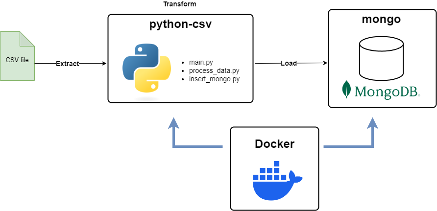

# Migration de la base de données médicales vers MongoDB

## Présentation de la mission

L’objectif de cette mission est de migrer des données médicales vers une base de données NoSQL. Le client rencontre des difficultés pour effectuer un **scaling horizontal** de sa base de données SQL actuelle. Nous souhaitons donc lui proposer **MongoDB**, une base NoSQL particulièrement adaptée à ce type de besoins.

MongoDB est une base NoSQL qui fonctionne sur un modèle **clé : document**. Autrement dit, les données ne sont pas stockées sous forme de lignes, mais sous forme de **documents**.  
Un document **n’a pas de structure fixe** et peut contenir des types de données variés. Concrètement, cela signifie que chaque document peut disposer de **colonnes** (ou champs) différentes, ce qui offre une grande souplesse pour le stockage et l’évolution du schéma des données.

L’un des avantages majeurs de MongoDB est la possibilité de recourir au **sharding**, une méthode de répartition (partitionnement) et de réplication des données. Le sharding permet de s’adapter à une croissance du nombre d’utilisateurs et à l’augmentation du volume de données, sans compromettre les performances.

Chez DataSoluTech, nous sommes convaincus que MongoDB est une solution cohérente pour répondre aux besoins de notre client. Cette page GitHub propose un prototype de la migration des données vers MongoDB, illustrant comment les données et les utilisateurs pourront interagir une fois la migration terminée.

---

## Présentation du prototype

Le prototype utilise Docker pour simuler les différentes machines constituant une partie de notre infrastructure de données. Voici le schéma de la migration :



### 1. Conteneur **python-csv**

- Le conteneur **python-csv** charge les données en utilisant la bibliothèque Polars.  
- Trois scripts Python sont utilisés dans ce conteneur :  
  1. **`process_data.py`** : charge les données, vérifie leur pertinence, crée les différents ID, etc.  
  2. **`insert_mongo.py`** : établit la connexion à la base MongoDB et insère les données préparées.  
  3. **`main.py`** : exécute les fonctions définies dans les autres scripts, après avoir récupéré les variables de configuration et initialisé les logs.

### 2. Conteneur **mongo**

- Le conteneur **mongo** contient la base de données MongoDB.  
- Deux scripts JavaScript sont utilisés pour initialiser la base :  
  1. **`create_users.js`** : crée les différents profils utilisateur de la base.  
  2. **`init_mongo.js`** : configure les paramètres de la base (création d’index, définition d’un schéma de validation JSON pour imposer certaines contraintes, etc.).

### 3. Fichier `.env`

- Le fichier d’environnement `.env` contient toutes les informations nécessaires au lancement de la base.  
- La plupart des modifications de configuration peuvent s’y faire, sans nécessiter de modifier le code.  
- Pour être correctement pris en compte par les scripts, le fichier `.env` doit être placé dans le dossier `/migration_mongodb`.

Exemple de contenu :

```bash
# Attributs de connexion au serveur Mongo
SERVER=mongo
PORT=27017

# Base de données et collections qui seront créées
DATABASE=db_medical
COLLECTION=hospital_admissions
COLLECTION_INFO=insert_informations

# Chemin du fichier de données et du dossier de logs Python
FILE_PATH=data/healthcare_dataset.csv
LOGGING_PATH=./python_logs

# Contraintes sur les colonnes utilisées dans le script Python
REQUIRED_COLUMNS=name,age,gender,blood_type,date_of_admission
PATIENT_ID_COLUMNS=name,age,gender,blood_type

# Rôles utilisateurs initialisés dans create_users.js
MONGO_ADMIN_USERNAME=admin
MONGO_ADMIN_PASSWORD=securepassword

MONGO_DEV_USERNAME=dev_user
MONGO_DEV_PASSWORD=securepassword

MONGO_RO_USERNAME=ro_user
MONGO_RO_PASSWORD=securepassword
```

---

## Système d’authentification et rôles utilisateur

MongoDB propose un système de rôles pour sécuriser l’accès à la base de données. Dans ce prototype, trois rôles utilisateur principaux sont configurés :

1. **Administrateur (`admin`)**  
   - Identifiants :  
     - Nom d’utilisateur : `MONGO_ADMIN_USERNAME`  
     - Mot de passe : `MONGO_ADMIN_PASSWORD`  
   - Droits :  
     - Accès en lecture et écriture sur toutes les bases.  
     - Gestion complète de la base (création ou suppression de rôles, gestion d’utilisateurs, etc.).

2. **Développeur (`dev_user`)**  
   - Identifiants :  
     - Nom d’utilisateur : `MONGO_DEV_USERNAME`  
     - Mot de passe : `MONGO_DEV_PASSWORD`  
   - Droits :  
     - Accès en lecture et écriture sur la base de données définie (par exemple `db_medical`).  
     - Utilisé pour les opérations courantes de développement (insertion, mise à jour, requêtes).

3. **Lecture seule (`ro_user`)**  
   - Identifiants :  
     - Nom d’utilisateur : `MONGO_RO_USERNAME`  
     - Mot de passe : `MONGO_RO_PASSWORD`  
   - Droits :  
     - Accès en lecture seule sur la base de données spécifiée.  
     - Pratique pour limiter les accès, par exemple à certains services ou applications devant uniquement consulter les données.

Ces rôles sont créés et configurés grâce au script **`create_users.js`**, exécuté au démarrage de la base.

---

## Lancement du prototype

Pour lancer le prototype, **[Docker Desktop](https://www.docker.com/products/docker-desktop/)** doit être installé et configuré sur votre machine.

1. Vérifiez la présence de Docker :  
   ```bash
   docker --version
   ```
   Cette commande doit renvoyer la version de Docker installée sur votre système.

2. Vérifiez que Docker est en cours d’exécution.  
3. Placez-vous dans le répertoire contenant le fichier `docker-compose.yml` :  
   ```bash
   cd /chemin/vers/le/dossier
   ```
4. Lancez la commande suivante :  
   ```bash
   docker compose up -d
   ```
   - Le paramètre `-d` permet de lancer les conteneurs en **mode détaché**. Vous pouvez continuer à utiliser le même terminal pendant l’exécution.  
   - Sans ce paramètre, vous verriez les logs en direct dans la console.

Au premier lancement, Docker télécharge et construit les images, ce qui peut prendre quelques minutes.

Si tout se passe bien, vous verrez apparaître dans les logs :  
```bash
python-csv exited with code 0
```
Cela indique que le script Python de chargement des données s’est correctement exécuté.  
Les logs du serveur Mongo peuvent être particulièrement verbeux. Afin de mieux distinguer ceux de Python, vous pouvez décommenter les lignes ci-dessous dans le `docker-compose.yml` :

```yml
logging:
  driver: "none"
```

---

## Interroger la base de données

Un fichier `notebook.ipynb` est fourni pour vous permettre de tester facilement les requêtes MongoDB. Vous y trouverez des exemples de requêtes et des commentaires explicatifs.

Vous pouvez également utiliser directement le **mongo shell** depuis le conteneur :

```bash
docker exec -it mongo mongosh -u admin -p securepassword
```

Pour plus d’informations sur l’utilisation des commandes MongoDB, la documentation officielle est disponible à l’adresse suivante :  
<https://www.mongodb.com/docs/mongodb-shell/run-commands/>

---

Avec ce prototype, vous disposez d’une base de données MongoDB configurée pour la gestion de données médicales, incluant un système d’authentification par rôles. Vous pouvez désormais étendre cette infrastructure selon les besoins spécifiques de votre projet.